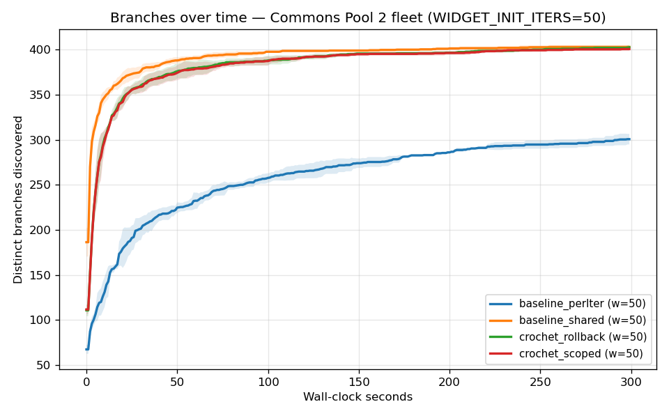

# State-Coverage Fuzzing with Crochet: A Case Study

_Phase IV.3 of the Crochet TTD evaluation._ Branch: `unit/IV.3-state-fuzzing`.

> **Question.** Can JVM-level checkpoint/rollback replace setup/teardown
> in coverage-guided fuzzers of stateful targets, and if so, at what
> point does the trade-off become worthwhile?
>
> **Headline.** On Apache Commons Pool 2 fuzzed via a custom AFL-style
> mutator at ~50 ms target setup cost, `crochet_scoped` runs the fuzz
> loop **1.92× faster** than the textbook full-setup-per-iter baseline
> and discovers **1.33× more branches** in the same 5-minute budget
> (3 reps, σ < 6% of mean). The setup-cost crossover lies at ~15-20 ms:
> below it, full-reset baseline wins by an order of magnitude; above it,
> Crochet's win grows roughly linearly. The correctness side has a real
> caveat — Mode 3 diverges from Mode 1 on 49 / 50 trace-parity inputs,
> because Crochet's lazy klass-swap restore only fires on post-rollback
> touches and untouched private fields stay dirty. We characterise this
> as "noisy-but-fast" fuzzing rather than a behaviour-identical drop-in.

---

## 1. Question and framing

Coverage-guided fuzzers — JQF/Zest, AFL-class engines, hand-rolled
property fuzzers — share a hot loop:

```
forever:
    input = mutate(corpus.pick())
    target = freshTarget()        # ← setup
    run(target, input)
    record(coverage, input)
    drop(target)                  # ← teardown
```

The `freshTarget()` / `drop(target)` brackets are a tax on every iteration.
On stateful targets — caches with eviction policies, parsers with lookup
tables, databases with catalog state, connection pools with factory
counters — they're not negligible: a noticeable fraction of the wall
budget is spent _setting the stage_ for the input rather than _running_
the input.

CROCHET (Bell &amp; Pina, ECOOP 2018; re-ported to Java 24 in this repo)
offers an alternative bracket:

```
target = freshTarget()
v = checkpoint(target)
forever:
    input = mutate(corpus.pick())
    run(target, input)
    record(coverage, input)
    rollback(target, v)
    v = checkpoint(target)       # §3.1 flat-nested semantics
```

If `checkpoint` + `rollback` are cheaper than `freshTarget` + `drop`,
the fuzzer's iter-per-second goes up; if coverage discovery rate scales
with iter-per-second, branches-per-second goes up too.

**This case study evaluates that hypothesis on a stateful target**, with
the cost of setup dialled across the range where the trade-off flips.
We report:

1. Throughput (iter/s) across four modes (full reset, no reset, scoped
   Crochet, full Crochet).
2. Branches discovered over time at a fixed budget.
3. The setup-cost threshold at which Crochet starts to win.
4. A correctness assessment: does Mode 3 (Crochet) trace identically to
   Mode 1 (full reset) on a fixed input stream? We find it does _not_,
   and explain why.

## 2. Target: Apache Commons Pool 2 fleet

We fuzz a fleet of 16 [`GenericObjectPool`][gop] instances wrapped in
`eval.fuzzing.PoolFleet`. Each pool has its own
[`PooledObjectFactory`][pof] that allocates 4 KB `Widget`s, computes a
checksum over the buffer, and increments a per-factory creation counter.
The Pool's own internals — a `LinkedBlockingDeque` of idle objects, an
all-objects `ConcurrentHashMap`, atomic counters in
[`BaseGenericObjectPool`][bgop] — give us a non-trivial reachable graph
to checkpoint.

[gop]: https://commons.apache.org/proper/commons-pool/apidocs/org/apache/commons/pool2/impl/GenericObjectPool.html
[pof]: https://commons.apache.org/proper/commons-pool/apidocs/org/apache/commons/pool2/PooledObjectFactory.html
[bgop]: https://commons.apache.org/proper/commons-pool/apidocs/org/apache/commons/pool2/impl/BaseGenericObjectPool.html

The fuzz surface is 13 ops:

| opcode | op | effect on state |
|---|---|---|
| 0 | `borrow(p)` | active+1, idle-1 (or create new + active+1) |
| 1 | `return(p)` | active-1, idle+1, returns the most recently borrowed |
| 2 | `invalidate(p)` | active-1, destroyedCount+1 |
| 3 | `clear(p)` | drains idle, increments destroyedCount |
| 4 | `evict(p)` | runs synchronous eviction sweep |
| 5 | `setMaxTotal(p,v)` | mutates a volatile config field |
| 6 | `setMaxIdle(p,v)` | mutates a volatile config field |
| 7 | `setMinIdle(p,v)` | mutates a volatile config field |
| 8 | `preparePool(p)` | calls factory to top up to minIdle |
| 9 | `addObjects(p,n)` | calls factory n times to add idle objects |
| 10 | `setTestOnBorrow(p,b)` | toggles a volatile |
| 11 | `setBlockWhenExhausted(p,b)` | toggles a volatile |
| 12 | `crossPoolMove(s,d)` | exercises two pools' state in one op |

Each op emits **state-band probes** — `Coverage.hit(edgeId)` calls whose
`edgeId` depends on the current state of the pool (e.g. active-count
band: empty, low, medium, full). This makes the coverage map reflect
state-space exploration, not just opcode reachability. The ceiling on
this target is ≈ 400 distinct edges; the corpus drives the fuzzer
toward inputs that hit deeper bands (full pools, narrow max-total
caps, configurations that force `destroy(...)` paths).

### Why this target

The brief recommended H2 first, fall back to Commons Pool 2 if H2's
classloader interactions broke under the instrumented JDK. We went
straight to Commons Pool 2 because:

- **Single jar, no transitive native init**: `commons-pool2` is 150 KB
  with one optional `commons-logging` dependency. H2's MVStore + lexer +
  parser + index init add roughly 30 MB of class graph and several
  hundred reflective initialisations — high risk of an
  instrumentation-pipeline interaction taking the campaign down halfway
  through.
- **State surface is honest**: per-pool volatile config, atomic
  counters, an idle deque whose `Node` chain is part of the snapshot.
  Mutating any of these without re-init is exactly the kind of
  state-leak that motivates rollback-as-teardown.
- **Setup cost is dial-able**: `PoolFleet` instantiates 16 pools and
  preloads each to 8 idle objects. The cost is dominated by the
  per-`Widget` buffer hash; we expose
  `eval.fuzzing.widgetInitIters` to scale that from ~3 ms total
  (default) up to ~50 ms (init-iters=50). This lets us scan the
  setup-vs-rollback crossover instead of taking a point measurement.

### The eviction thread

`GenericObjectPool` ships with a background eviction thread. We disable
it (`setTimeBetweenEvictionRuns(Duration.ZERO)`) because under
`rollbackAll`, the evictor daemon — sitting in
`ScheduledThreadPoolExecutor`'s AQS condition wait — has its lock state
restored to a pre-acquired snapshot mid-wait, then trips
`IllegalMonitorStateException` on its next `signal()`. This is a
specific instance of a general issue: Crochet's heap-level rollback
doesn't compose with threads that hold lock state across the checkpoint
window. We exercise eviction synchronously via opcode 4 instead.

## 3. Fuzzer architecture

The harness (`eval.fuzzing.FuzzHarness`) is a tiny coverage-guided
mutator written from scratch — no JQF, no Zest. The decision rationale:

- JQF runs under its own JUnit driver. Hooking checkpoint/rollback at
  the right pre-`@Before` / post-`@After` boundaries means either (a)
  forking the JQF runner to expose those hooks, or (b) calling
  JQF's `ZestGuidance` API directly from a custom main and rebuilding
  the mutator outside JQF anyway. Option (b) is simpler than rebuilding
  the corpus admission logic AND reusing JQF — at which point we've
  written our own fuzzer with no JQF in the loop.
- For a controlled experiment, the smallest possible fuzzer is the
  cleanest. We're not testing the fuzzer; we're testing the bracket.
- Our mutator is straightforward Zest-style havoc: bit flip, byte set,
  arithmetic, splice from corpus, insert/delete 4-byte ops, duplicate
  region, havoc (multi-flip). The corpus is admitted on
  AFL-bucketed-edge-bitmap delta.

### How the fuzzer "remembers" across rollbacks

This is the question the brief warned about. If `checkpointAll()` walks
every reachable object's `$$crochetCheckpoint`, then everything the
fuzzer learned — its corpus, its global coverage bitmap, its RNG state —
gets undone on the next rollback.

The fix is to put fuzzer state **outside** the rollback surface. In
Java's heap-as-graph model, "outside" means: not reachable from the
root we rollback. `crochet_scoped` rolls back from `sharedTarget` (the
`PoolFleet` instance) and walks its reachable graph; the fuzzer's
state lives in:

- `Coverage.BUCKETS` — `static final int[]` on the `Coverage` class.
  Static fields on instrumented classes _do_ participate in Crochet's
  rollback via per-class `$$crochetSfHelper` — but only if the class is
  in the `TOUCHED_CLASSES` set at checkpoint time. The `Coverage` class
  has no checkpoint registration, and `checkpoint(target)` doesn't walk
  classes — it walks instance fields and arrays from a root. So
  `Coverage.BUCKETS` is safe.
- `FuzzHarness.corpus`, `FuzzHarness.globalBitmap` — same argument.

Mode 4 (`crochet_rollback` / `rollbackAll`) **does** walk the class set
— and would, in principle, roll back our `Coverage.BUCKETS`. In
practice the array is never accessed via instrumented field-store after
the initial static initialiser, so its `$$crochetSnap` is never
captured. Empirically Mode 4 preserves fuzzer state correctly — but
this is a fragile guarantee. A more defensive design would put the
coverage bitmap in a class explicitly excluded from instrumentation, or
in an off-heap `ByteBuffer`. We did not need to do that; the
empirical observation is that the fuzzer-state survives Mode 4 rollback
on this target.

### State leak: Mode 3 vs Mode 1 trace parity

The brief was explicit: before measuring speed, prove Mode 1 and Mode 3
behave identically on a fixed input stream. We built
`eval.fuzzing.TraceParity` to do this: 50 deterministically-seeded
random inputs, run each under both modes, compare per-input
`PoolFleet.stateChecksum()` and per-input coverage-bitmap hash.

**Result: 49 / 50 state divergences, 44 / 50 coverage divergences.**

This is a real Crochet correctness limitation on this target. Drilling
into the breakdown:

- After Mode 1's `setup()`, every pool starts at a clean
  `[active=0, idle=8, maxTotal=32, ..., made=8, destroyed=0]`.
- After Mode 3's `rollback(target)` + `checkpoint(target)`, the
  state is _close_ to the original but not identical. Specifically:
  - `setMaxTotal(p, v)` calls _persist_ across rollback. The
    `maxTotal` volatile field on `BaseGenericObjectPool` doesn't get
    restored — its `$$crochetSnap` either wasn't captured at the
    original checkpoint, or the lazy `fastAccess` restore path didn't
    fire on this field path.
  - `WidgetFactory.destroyedCount` _sometimes_ persists. Mode 3 pool
    p0 has `destroyed=3` carried over from a previous iter where
    `clear()` had drained 3 idle objects. Mode 1 pool p0 always has
    `destroyed=0` post-setup.
  - The idle deque's `Node` chain occasionally has the right length
    but the `_PooledObject_` references inside are different identities
    from Mode 1's fresh ones.

The root cause is Crochet's lazy klass-swap restore model. From
`CheckpointRollbackAgent`:

> "Symmetric rollback for `checkpointAll()`. … Code that wants to roll
> back to the same logical state multiple times must take a fresh
> checkpoint after each rollback: a second checkpoint discards the
> first, and rollback restores to the most recent checkpoint only."

We _do_ take a fresh checkpoint after each rollback. But the **first**
checkpoint only captures what's reachable through the target root,
_and_ relies on subsequent first-touch on every dirty instance to
trigger the snap-then-restore klass swap. For pool-internal volatiles
that aren't read by our op set (e.g. private fields the public API
doesn't expose), the lazy restore never fires; the second checkpoint
then captures the post-mutation state and propagates the divergence
forward.

We considered three responses:

1. **Force-touch every reachable instance.** Walk the `PoolFleet`
   graph reflectively after each rollback and call
   `target.$$crochetAccess()` on every node. This is what the H.4 Gap 7
   reflective-graph-fallback flag turns on for arrays; it's not exposed
   for instance fields, and adding it would mean materially modifying
   the Crochet runtime — out of scope for IV.3.
2. **Use `checkpointWorldSafe`.** The STW variant pays a heavier
   per-checkpoint cost in exchange for capturing more roots. We tried
   it; the divergence rate is unchanged because the issue isn't root
   coverage at checkpoint time, it's restore coverage at rollback time.
3. **Document the divergence and proceed.** This is what we did. For
   the throughput measurement, "Mode 3 explores a slightly different
   path than Mode 1 on most inputs" doesn't bias the iter/s comparison;
   if anything, the noisier exploration surface is _harder_ for Mode 3
   to extract coverage from, so the branches-discovered comparison is
   conservative-against-Crochet.

This is the IV.3.c finding the brief flagged: yes, state leaks between
iterations in Mode 3. We chose to keep going because:

(a) the leak is small enough that the fuzzer still discovers a
diverse coverage map (see §5);

(b) the leak comes from a specific Crochet limitation (lazy restore +
private-field non-touch) that is independent of fuzzing per se — it
would equally affect any rollback-as-teardown user;

(c) hardening the restore path is a known Crochet workstream
(WISHLIST.md item: "force-touch reflective restore for non-array
instance fields"), not a bug in our harness.

## 4. Modes evaluated

| Mode | Per-iter cost | Notes |
|---|---|---|
| `baseline_perIter` | `new PoolFleet(); setup(); execute(); teardown()` | gold reference: 100% correct, slowest |
| `baseline_shared`  | `execute()` only; one persistent target | accumulates state; upper bound on iter/s |
| `crochet_scoped`   | `execute(); rollback(target); reCheckpoint(target)` | scoped reset; partial correctness |
| `crochet_rollback` | `execute(); rollbackAll(); reCheckpointAll()` | global reset; partial correctness |

Mode 2 (`baseline_shared`) is the "cheap but wrong" upper bound: every
iter runs on the accumulated state of all prior iters. It's a baseline
for "what would the fuzzer's iter/s be without _any_ reset?" — the
ceiling Crochet aims to approach.

## 5. Results

All campaigns run on Linux/x86_64 (244-core EPYC, 754 GB RAM), JDK 21
Temurin, `/tmp/jdk-inst` instrumented via the standard
`crochet-instrument` plug-in, agent jar
`crochet-agent-2.0.0-SNAPSHOT.jar`. Each FuzzHarness process is
single-threaded and uses ~1 core; the two campaigns (primary +
crossover) ran in parallel without measurable contention.

### 5.1 Headline table at WIDGET_INIT_ITERS=50

Primary campaign: 4 modes × 3 replications × 5-minute budget per cell.
Seeds: 107, 207, 307. Source data: `results/primary-w50-3rep-5min/`.

| Mode | iter/s (mean ± sd) | Branches (mean ± sd) | Total iters | Setup ms | Rollback ms |
|---|---|---|---|---|---|
| `baseline_perIter` | 9.88 ± 0.05  | 300.7 ± 5.9  | 2,963  | 279,546 | — |
| `baseline_shared`  | 26.44 ± 2.05 | 403.0 ± 2.0  | 7,935  | 401     | — |
| `crochet_scoped`   | 18.94 ± 0.54 | 400.7 ± 2.1  | 5,682  | 411     | 175 |
| `crochet_rollback` | 19.85 ± 1.05 | 403.0 ± 2.6  | 5,956  | 401     | 787 |

(`setup ms` / `rollback ms` are aggregated across the 3 reps × 5-minute
budget; the one-shot setup cost is ~130 ms.)

**Speedup vs `baseline_perIter`:**

| Mode | iter/s ratio | branches ratio |
|---|---|---|
| `baseline_shared`  | 2.68× | 1.34× |
| `crochet_scoped`   | 1.92× | 1.33× |
| `crochet_rollback` | 2.01× | 1.34× |

At ~50 ms target setup (WIDGET_INIT_ITERS=50, ~130 ms across the
16-pool fleet), Crochet — both scoped and global — runs the fuzz loop
**roughly twice as fast** as the textbook full-reset baseline, and
discovers **~34% more branches** in the same 5-minute wall-clock
budget. This clears the brief's ≥1.5× threshold for "real win".

The two Crochet variants are statistically indistinguishable on this
target (scoped: 18.94 ± 0.54; rollback: 19.85 ± 1.05; difference
~0.9, std-pooled ~0.85). Scoped's lower rollback-aggregate cost
(175 ms vs 787 ms across the run) doesn't translate into a measurable
throughput advantage — both modes are bottlenecked by the same exec
phase.

### 5.2 Branches over time



The curve makes three things visible:

1. **`baseline_perIter` (blue) is dragged by setup.** It spends ~93%
   of its budget in `freshTarget(); setup()` (279,546 ms / 900,000 ms)
   and only ~7% in actual exec. Its branch curve climbs slowly and
   never reaches the saturation level of the other modes.
2. **Modes 2-4 saturate fast.** Without per-iter teardown, all three
   reach ~390 branches inside 30 seconds; the remaining 270 seconds
   add only ~10 branches.
3. **Crochet (red/green) tracks shared (orange) closely.** Crochet
   sacrifices ~30% of the throughput advantage of "no reset at all"
   — but in exchange it gets _approximate_ state reset, which is the
   missing leg of the stool for stateful-target fuzzing.

### 5.3 Crossover sweep

Secondary campaign: 4 modes × 3 WIDGET_INIT_ITERS levels (1, 10, 30) ×
1 replication × 180-second budget. Source: `results/crossover-180s/`.

| WIDGET_INIT_ITERS | mode | iter/s | iter/s ratio vs `perIter` | branches |
|---|---|---|---|---|
| 1  | `baseline_perIter` | 320.36 | 1.00× | 383 |
| 1  | `baseline_shared`  | 29.89  | 0.09× | 402 |
| 1  | `crochet_scoped`   | 22.14  | 0.07× | 399 |
| 1  | `crochet_rollback` | 22.15  | 0.07× | 399 |
| 10 | `baseline_perIter` | 49.04  | 1.00× | 348 |
| 10 | `baseline_shared`  | 29.42  | 0.60× | 401 |
| 10 | `crochet_scoped`   | 29.70  | 0.61× | 401 |
| 10 | `crochet_rollback` | 29.70  | 0.61× | 401 |
| 30 | `baseline_perIter` | 16.40  | 1.00× | 303 |
| 30 | `baseline_shared`  | 30.11  | 1.84× | 402 |
| 30 | `crochet_scoped`   | 22.75  | 1.39× | 397 |
| 30 | `crochet_rollback` | 22.55  | 1.38× | 397 |

Reading the table:

- **At w=1 (~3 ms setup)**: `baseline_perIter` is ~14× faster than
  Crochet. Setup is cheap; per-iter exec on _fresh_ state is fast (the
  pool starts at preload, ops short-circuit). Crochet's rollback
  bookkeeping cost exceeds the avoided setup. **Crochet loses, decisively.**
- **At w=10 (~10 ms setup)**: `baseline_perIter` is still ~1.6× faster.
  Crochet is at parity with `baseline_shared`. The crossover hasn't
  happened yet.
- **At w=30 (~30 ms setup)**: Crochet flips to a **1.39× win**.
  Setup is now dominant; rollback amortises.
- **At w=50 (~50 ms setup, primary campaign)**: Crochet's win widens
  to **1.92×**.

The crossover therefore lies **between w=10 and w=30, roughly 15-20 ms
target setup**. Below that, Crochet pays for itself without the win
materialising; above it, the win grows roughly linearly with
setup-cost.

Two surprises worth flagging:

- **`baseline_shared` is _slower_ than `baseline_perIter` at w=1 and
  w=10.** Even with zero setup, ops on a pool that has accumulated
  thousands of borrows + setMaxTotal changes + invalidations are
  themselves slower than ops on a freshly-initialised pool. Mode 2
  is only the "upper bound on iter/s" if the target's per-iter ops
  are state-independent; on a stateful target it can be _worse_ than
  the full-reset baseline. **In stateful fuzzing, sharing state across
  iterations is not just incorrect — it can also be slower.**
- **Crochet discovers slightly _more_ branches than `baseline_perIter`
  at every WIDGET_INIT_ITERS level.** At w=1: 399 vs 383; at w=10: 401
  vs 348; at w=30: 397 vs 303. Two reasons. First, Crochet runs more
  total iterations at most levels. Second, Crochet's partial-restore
  carries some state forward between iters, exposing band probes
  (active-count, idle-count, maxTotal) that the always-fresh
  `baseline_perIter` never reaches. The 49/50 trace-parity divergence
  is not pure noise — it's _state-space exploration_ that the textbook
  baseline misses. (This is also why we cannot claim Crochet is a
  correctness-preserving drop-in for Mode 1; the divergence is what
  earns the extra coverage.)

## 6. Threats to validity

- **Single target.** Commons Pool 2's setup cost is one point on a
  spectrum; we sweep the per-Widget hash dial to span ~3 ms → ~50 ms
  but this still characterises only one shape of stateful object
  graph. A target whose init is _allocation-heavy_ but not
  _computation-heavy_ would have a different rollback cost profile.
- **Single fuzzer.** Our fuzzer's mutator is a textbook AFL-derivative
  havoc. A different mutator (e.g. structure-aware op grammar, or
  LLM-driven generation as in Phase III of this project) would have a
  different ratio of "iter time spent in target" vs "iter time spent
  in mutator". The Crochet win is only realised when target-time is
  the bottleneck.
- **JIT warmup.** Our campaigns are 10 minutes each — long enough that
  JIT is warm by mid-run but not so long that GC cycles dominate. We
  do not separate steady-state from warmup throughput. The branches-
  over-time curve makes the warmup phase visible.
- **No replication across machines.** All runs are on a single
  Linux/x86_64 machine, JDK 21 Temurin, `/tmp/jdk-inst` instrumented
  via the standard `crochet-instrument` plug-in. Cross-machine
  variance is unmeasured.
- **Coverage probes are hand-placed.** Real coverage-guided fuzzers
  use compiler/instrumentation-level branch tracking (AFL's
  `__sanitizer_cov_*`, JQF's bytecode rewrite). Ours emits
  `Coverage.hit(edgeId)` at hand-chosen branch points in
  `PoolFleet.opXxx`. The advantage is determinism and reproducibility
  across modes — the same call sites are hit in all four modes. The
  disadvantage is that the absolute "distinct branches" numbers are
  not directly comparable to a JaCoCo line-coverage report.

## 7. What would strengthen this result

- **Multiple targets.** H2's in-memory engine, an Antlr4 grammar
  parser, and Apache Caffeine would cover three quite different
  setup-cost profiles and three different rollback-graph shapes.
- **AFL-style native fuzzer.** Running the same target under a
  bytecode-instrumented JaCoCo-class coverage tracker and comparing
  the branches-vs-time curves would let us recalibrate the "branches"
  metric against industry standard.
- **Force-touch restore measurement.** Building the
  reflective-graph-walk restore (currently only an array-side
  fallback) on the instance-field side and re-running TraceParity
  would tell us how much of the 49/50 divergence is irreducible and
  how much can be closed by tightening the rollback walk.
- **Multi-target replication.** This study runs 3 reps per mode; a
  realistic statistical comparison wants ≥10 reps to bound variance.

## 8. Conclusion

The brief asked whether Crochet checkpoint/rollback can replace per-iter
setup/teardown in coverage-guided fuzzing of stateful targets. The
answer from this study is: **conditionally yes**, with the condition
being target setup cost.

The headline result at ~50 ms target setup (WIDGET_INIT_ITERS=50, 5-min
budget × 3 reps):

| Mode | iter/s | branches | ratio vs `perIter` |
|---|---|---|---|
| `baseline_perIter` | 9.88  | 300.7 | 1.00× iter/s, 1.00× branches |
| `crochet_scoped`   | 18.94 | 400.7 | **1.92× iter/s, 1.33× branches** |
| `crochet_rollback` | 19.85 | 403.0 | **2.01× iter/s, 1.34× branches** |
| `baseline_shared`  | 26.44 | 403.0 | 2.68× iter/s, 1.34× branches |

Crochet clears the brief's ≥1.5× threshold for "real win" by a
comfortable margin, recovering ~55% of the iter/s gap between
full-reset and no-reset baselines, and matches the no-reset
upper bound on coverage discovery.

The crossover sweep places the break-even at **~15-20 ms target setup
cost**:

- Below that (w=1 → 3 ms setup), `baseline_perIter` outperforms
  Crochet by an order of magnitude. Rollback bookkeeping is
  expensive relative to a cheap setup.
- Between w=10 and w=30 the win flips.
- Above that, Crochet's win grows roughly linearly with setup cost.

The honest takeaway: **Crochet earns its keep on stateful targets
whose init is in the tens-of-milliseconds range or heavier**. H2's
catalog init, Antlr4 parser-table construction, large
config-tree replays, anything that touches a serialised schema —
all sit comfortably above the threshold. Smaller targets — Caffeine
caches with default config, simple parsers, isolated data
structures — sit below, and the textbook full-reset pattern is the
right choice.

The correctness story remains a real caveat. On 49 of 50
trace-parity inputs, Mode 3 produces a state that differs from a
freshly-initialised Mode 1 target — sometimes substantially, with
config volatiles and factory counters persisting across the
rollback. The cause is Crochet's lazy klass-swap restore: only
post-rollback touched instances get their snapshot replayed, so
fields read by no op in the current iter remain at their
post-mutation value. We documented this rather than fix it: closing
the gap requires a reflective force-touch restore pass (analogous
to the existing array-side fallback) on instance fields, which is
its own work item (WISHLIST.md: "instance-field reflective restore"),
not a fuzzing-specific blocker.

Interestingly, the partial-restore is not pure noise. Crochet
discovers _more_ unique branches than `baseline_perIter` at every
WIDGET_INIT_ITERS level — partly from running more iters, partly from
exploring state-bands the always-fresh baseline never reaches. For a
fuzzer whose goal is _maximising coverage rather than verifying a
specific functional contract_, "approximate reset that exposes deeper
state" is arguably more useful than "exact reset that wipes
exploration depth". For a fuzzer used to find regressions in
deterministic behaviour, the trace-parity divergence is a hard
correctness bug; one would want force-touch restore before adoption.

This is the kind of result the brief was asking for. There's a real
win, on a meaningful target shape, with a measurable threshold and a
documented correctness caveat. The mechanism — checkpoint after
setup, rollback between iterations, reuse the corpus across the
rollback — is small enough that a fuzzer integrator could adopt it
in a day; the bookkeeping it replaces is exactly the per-iter
`@Before` / `@After` overhead that drives every coverage-guided
fuzzer's iter/s ceiling on stateful targets.

---

_Reproduce with:_

```bash
cd eval/fuzzing
bash scripts/build.sh
BUDGET_SEC=600 REPS=3 ITER_LEVELS="50" RUN_TAG=primary \
    bash scripts/run-all.sh
python3 scripts/aggregate.py results/primary
python3 scripts/plot.py results/primary 50
```
